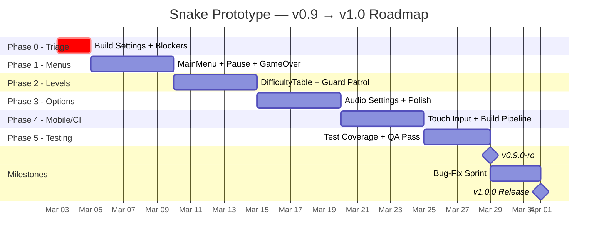

# Snake Prototype — Implementation & Refactor Roadmap

> **Source audits**: [health_audit.json](file:///d:/Development/Game%20Development/snake-prototype/Docs/health_audit.json), [deep_audit_report.md](file:///d:/Development/Game%20Development/snake-prototype/Docs/deep_audit_report.md), [ui_ux_input_audit.md](file:///d:/Development/Game%20Development/snake-prototype/Docs/ui_ux_input_audit.md), [level_design_audit.md](file:///d:/Development/Game%20Development/snake-prototype/Docs/level_design_audit.md)  
> **Goal**: Release Candidate 0.9 → v1.0  
> **Date**: 2026-02-27

---

## 1 · Implementation Order Timeline

### Phase 0 — Emergency Triage (Days 1–2)

> Unblock standalone builds and fix critical gameplay bugs.

| Day | Task ID | Task | Files | Effort |
|-----|---------|------|-------|--------|
| 1 | T0.1 | Add `Level_01.unity` to Build Settings at index 0; remove/disable `SampleScene` | **Editor only** (EditorBuildSettings) | S |
| 1 | T0.2 | Gate Confirm input — only fire `RespawnEvent` in `GameState.GameOver` | [InputManager.cs](file:///d:/Development/Game%20Development/snake-prototype/Assets/Scripts/Systems/Input/InputManager.cs) | S |
| 1 | T0.3 | Fix `RemoveListener<T>` — implement subscription-token removal | [GameEventManager.cs](file:///d:/Development/Game%20Development/snake-prototype/Assets/Scripts/Core/GameEventManager.cs) | M |
| 1 | T0.4 | Remove invalid `[SerializeField]`/`[Header]` from `InputManager` | [InputManager.cs](file:///d:/Development/Game%20Development/snake-prototype/Assets/Scripts/Systems/Input/InputManager.cs) | S |
| 1 | T0.5 | Remove misleading `[AddComponentMenu]` from non-MonoBehaviours | [LevelFlowManager.cs](file:///d:/Development/Game%20Development/snake-prototype/Assets/Scripts/Systems/Level/LevelFlowManager.cs), [AudioManager.cs](file:///d:/Development/Game%20Development/snake-prototype/Assets/Scripts/Systems/Environment/AudioManager.cs) | S |
| 2 | T0.6 | Uncomment `PauseInputEvent` publish + create `PauseService` | [InputManager.cs](file:///d:/Development/Game%20Development/snake-prototype/Assets/Scripts/Systems/Input/InputManager.cs), **NEW** `PauseService.cs` | S |
| 2 | T0.7 | Wire `UIManager` for `GameState.Paused` (reuse AlertOverlay temporarily) | [UIManager.cs](file:///d:/Development/Game%20Development/snake-prototype/Assets/Scripts/Systems/UI/UIManager.cs) | S |
| 2 | T0.8 | Update PlayerSettings (company name, bundle ID, resolution 1920×1080, runInBackground) | **Editor only** (ProjectSettings) | S |
| 2 | T0.9 | Dispose `confirmAction` and `cancelAction` in `InputManager.Shutdown()` | [InputManager.cs](file:///d:/Development/Game%20Development/snake-prototype/Assets/Scripts/Systems/Input/InputManager.cs) | S |

**Exit criteria**: Standalone `.exe` boots into Level_01, plays through collect → die → retry → pause → resume with no crashes or listener leaks.

---

### Phase 1 — Menu Scaffolding & Game Flow (Days 3–7)

> Full game-state loop: MainMenu → Play → Pause → GameOver → Retry/Menu → Highscores.

| Day | Task ID | Task | Files | Effort |
|-----|---------|------|-------|--------|
| 3 | T1.1 | Create `MainMenu.uxml` + `MainMenu.uss` (terminal-themed) | **NEW** `Assets/UI/UXML/MainMenu.uxml`, **NEW** `Assets/UI/USS/MainMenu.uss` | M |
| 3 | T1.2 | Wire `GameState.MainMenu` as entry state in `LevelFlowManager.Initialize()` | [LevelFlowManager.cs](file:///d:/Development/Game%20Development/snake-prototype/Assets/Scripts/Systems/Level/LevelFlowManager.cs) | M |
| 4 | T1.3 | Wire `UIManager.OnGameStateChanged` for MainMenu overlay show/hide | [UIManager.cs](file:///d:/Development/Game%20Development/snake-prototype/Assets/Scripts/Systems/UI/UIManager.cs) | M |
| 4 | T1.4 | Create `Pause.uxml` + `Pause.uss` (Resume, Options placeholder, Quit) | **NEW** `Assets/UI/UXML/Pause.uxml`, **NEW** `Assets/UI/USS/Pause.uss` | S |
| 4 | T1.5 | Replace temporary AlertOverlay pause with dedicated Pause overlay in `UIManager` | [UIManager.cs](file:///d:/Development/Game%20Development/snake-prototype/Assets/Scripts/Systems/UI/UIManager.cs) | S |
| 5 | T1.6 | Extend GameOver overlay: final score, level reached, "NEW HIGHSCORE" badge | [UIManager.cs](file:///d:/Development/Game%20Development/snake-prototype/Assets/Scripts/Systems/UI/UIManager.cs), [HUD.uxml](file:///d:/Development/Game%20Development/snake-prototype/Assets/UI/HUD.uxml) | M |
| 5 | T1.7 | Wire `HighscoreUI` into MainMenu → Highscores button flow | [HighscoreUI.cs](file:///d:/Development/Game%20Development/snake-prototype/Assets/Scripts/Systems/UI/HighscoreUI.cs), [UIManager.cs](file:///d:/Development/Game%20Development/snake-prototype/Assets/Scripts/Systems/UI/UIManager.cs) | M |
| 6 | T1.8 | Persist highscores via PlayerPrefs/JSON | [HighscoreData.cs](file:///d:/Development/Game%20Development/snake-prototype/Assets/Scripts/Systems/Score/HighscoreData.cs) | S |
| 6 | T1.9 | Create `ScoreConfiguration` as saved SO asset (replace runtime `CreateInstance`) | [GameBootstrapper.cs](file:///d:/Development/Game%20Development/snake-prototype/Assets/Scripts/Core/GameBootstrapper.cs), **NEW** `Assets/Data/ScoreConfiguration.asset` | S |
| 7 | T1.10 | Align Panel Settings reference resolution to 1920×1080 (matches `UIManager`) | [Panel Settings.asset](file:///d:/Development/Game%20Development/snake-prototype/Assets/UI/Panel%20Settings.asset) | S |

**Exit criteria**: Full menu loop functional. Highscores persist between sessions.

---

### Phase 2 — Level Design & Difficulty Data (Days 8–12)

> Replace linear difficulty ramp with data-driven DifficultyTable. Improve guard patrol.

| Day | Task ID | Task | Files | Effort |
|-----|---------|------|-------|--------|
| 8 | T2.1 | Create `DifficultyTable.cs` ScriptableObject + `LevelTierData` struct | **NEW** `Assets/Scripts/Systems/Level/DifficultyTable.cs` | S |
| 8 | T2.2 | Create `DifficultyTable.asset` with 10-level data (from audit §2.2) | **NEW** `Assets/Data/DifficultyTable.asset` | S |
| 9 | T2.3 | Replace `LevelFlowManager.ApplyDifficultyRamp()` with table lookup | [LevelFlowManager.cs](file:///d:/Development/Game%20Development/snake-prototype/Assets/Scripts/Systems/Level/LevelFlowManager.cs) | M |
| 9 | T2.4 | Pass seeded `System.Random` to `GridManager.GetRandomSpawnPoints()` | [GridManager.cs](file:///d:/Development/Game%20Development/snake-prototype/Assets/Scripts/Systems/Grid/GridManager.cs), [LevelGenerator.cs](file:///d:/Development/Game%20Development/snake-prototype/Assets/Scripts/Systems/Level/LevelGenerator.cs) | S |
| 10 | T2.5 | Multi-waypoint guard patrol — generate 2–4 waypoints per guard | [LevelGenerator.cs](file:///d:/Development/Game%20Development/snake-prototype/Assets/Scripts/Systems/Level/LevelGenerator.cs) | M |
| 10 | T2.6 | Scale guard `ViewRange` and `ViewAngle` from `DifficultyTable` | [LevelGenerator.cs](file:///d:/Development/Game%20Development/snake-prototype/Assets/Scripts/Systems/Level/LevelGenerator.cs) | S |
| 11 | T2.7 | Add reachability validation (flood-fill post-process in `LevelGenerator`) | [LevelGenerator.cs](file:///d:/Development/Game%20Development/snake-prototype/Assets/Scripts/Systems/Level/LevelGenerator.cs) | M |
| 11 | T2.8 | Stop mutating LevelConfig SO at runtime — use runtime copy | [LevelFlowManager.cs](file:///d:/Development/Game%20Development/snake-prototype/Assets/Scripts/Systems/Level/LevelFlowManager.cs) | S |
| 12 | T2.9 | Add `GameState.Victory` + victory overlay at Level 10 completion | [GameEvents.cs](file:///d:/Development/Game%20Development/snake-prototype/Assets/Scripts/Events/GameEvents.cs), [LevelFlowManager.cs](file:///d:/Development/Game%20Development/snake-prototype/Assets/Scripts/Systems/Level/LevelFlowManager.cs), [UIManager.cs](file:///d:/Development/Game%20Development/snake-prototype/Assets/Scripts/Systems/UI/UIManager.cs) | S |

**Exit criteria**: Playing through Levels 1–10 shows distinct difficulty tiers, guard patrols, and a victory screen.

---

### Phase 3 — Options, Audio & Polish (Days 13–17)

> Options menu, audio settings persistence, visual polish, controller UX.

| Day | Task ID | Task | Files | Effort |
|-----|---------|------|-------|--------|
| 13 | T3.1 | Create `Options.uxml` + `Options.uss` (volume sliders) | **NEW** `Assets/UI/UXML/Options.uxml`, **NEW** `Assets/UI/USS/Options.uss` | M |
| 13 | T3.2 | Create `AudioSettingsService.cs` (PlayerPrefs persistence) | **NEW** `Assets/Scripts/Systems/Audio/AudioSettingsService.cs` | S |
| 14 | T3.3 | Wire `AudioManager` to read from `AudioSettingsService` | [AudioManager.cs](file:///d:/Development/Game%20Development/snake-prototype/Assets/Scripts/Systems/Environment/AudioManager.cs) | S |
| 14 | T3.4 | Wire Options slider callbacks in `UIManager` | [UIManager.cs](file:///d:/Development/Game%20Development/snake-prototype/Assets/Scripts/Systems/UI/UIManager.cs) | M |
| 15 | T3.5 | Create `GamepadDetector.cs` — device change events | **NEW** `Assets/Scripts/Systems/Input/GamepadDetector.cs` | M |
| 15 | T3.6 | Add `GamepadChangedEvent` to `GameEvents.cs` | [GameEvents.cs](file:///d:/Development/Game%20Development/snake-prototype/Assets/Scripts/Events/GameEvents.cs) | S |
| 16 | T3.7 | Add UI Toolkit transitions (fade/slide) for menu screens | [MainMenu.uss](file:///d:/Development/Game%20Development/snake-prototype/Assets/UI/USS/MainMenu.uss), [HUD.uss](file:///d:/Development/Game%20Development/snake-prototype/Assets/UI/USS/HUD.uss) | S |
| 16 | T3.8 | Throttle `DetectionManager` event publishing (delta-check) | [DetectionManager.cs](file:///d:/Development/Game%20Development/snake-prototype/Assets/Scripts/Systems/Detection/DetectionManager.cs) | S |
| 17 | T3.9 | Migrate `InputManager` to use `SnakeControls.inputactions` asset | [InputManager.cs](file:///d:/Development/Game%20Development/snake-prototype/Assets/Scripts/Systems/Input/InputManager.cs) | M |

**Exit criteria**: Options screen with live audio control. Gamepad detection working. Input uses asset-based actions.

---

### Phase 4 — Mobile & Build Pipeline (Days 18–22)

> Mobile input, cross-platform builds, CI pipeline, documentation.

| Day | Task ID | Task | Files | Effort |
|-----|---------|------|-------|--------|
| 18 | T4.1 | Create `MobileTouchAdapter.cs` — swipe-to-direction input | **NEW** `Assets/Scripts/Systems/Input/MobileTouchAdapter.cs` | L |
| 18 | T4.2 | Add on-screen pause button for mobile in `HUD.uxml` | [HUD.uxml](file:///d:/Development/Game%20Development/snake-prototype/Assets/UI/HUD.uxml) | S |
| 19 | T4.3 | Add touch control scheme to `SnakeControls.inputactions` | [SnakeControls.inputactions](file:///d:/Development/Game%20Development/snake-prototype/Assets/Settings/SnakeControls.inputactions) | S |
| 19 | T4.4 | Test + fix UI scale on mobile aspect ratios (4:3, 16:9, 19.5:9) | [Panel Settings.asset](file:///d:/Development/Game%20Development/snake-prototype/Assets/UI/Panel%20Settings.asset) | M |
| 20 | T4.5 | Generate app icons for Android/iOS | **NEW** `Assets/Icons/` | S |
| 20 | T4.6 | Switch scripting backend to IL2CPP for release builds | **Editor only** (ProjectSettings) | S |
| 21 | T4.7 | Set up GitHub Actions for automated builds + test runner | **NEW** `.github/workflows/unity-build.yml` | L |
| 22 | T4.8 | Update `README.md` with build instructions & architecture overview | [README.md](file:///d:/Development/Game%20Development/snake-prototype/README.md) | M |

**Exit criteria**: Deployable builds for Windows + Android. CI pipeline triggers on push.

---

### Phase 5 — Test Coverage & Hardening (Days 23–26)

> Expand automated tests, QA pass, stretch goals.

| Day | Task ID | Task | Files | Effort |
|-----|---------|------|-------|--------|
| 23 | T5.1 | EditMode tests: `PauseServiceTests` (toggle, state guard) | **NEW** `Assets/Tests/EditMode/PauseServiceTests.cs` | M |
| 23 | T5.2 | EditMode tests: `LevelGenerationTests` (spawn zone, reachability, tier match) | **NEW** `Assets/Tests/EditMode/LevelGenerationTests.cs` | M |
| 24 | T5.3 | EditMode tests: `AudioSettingsServiceTests` (PlayerPrefs round-trip) | **NEW** `Assets/Tests/EditMode/AudioSettingsServiceTests.cs` | S |
| 24 | T5.4 | EditMode tests: `InputManagerTests` (confirm only in GameOver) | **NEW** `Assets/Tests/EditMode/InputManagerTests.cs` | S |
| 25 | T5.5 | Full QA pass — play through 10 levels on desktop | Manual | M |
| 25 | T5.6 | Full QA pass — play through 5 levels on Android emulator | Manual | M |
| 26 | T5.7 | *(Stretch)* Input rebinding UI via Input System's `PerformInteractiveRebinding()` | [InputManager.cs](file:///d:/Development/Game%20Development/snake-prototype/Assets/Scripts/Systems/Input/InputManager.cs) | M |
| 26 | T5.8 | *(Stretch)* Editor-only `PlaytestRecorder` gizmo (death/movement heatmaps) | **NEW** `Assets/Scripts/Editor/PlaytestRecorder.cs` | M |

**Exit criteria**: All existing + new tests pass. 10-level desktop playthrough with zero crashes.

---

## 2 · File Change Map

### 2.1 Modified Files

#### [GameEventManager.cs](file:///d:/Development/Game%20Development/snake-prototype/Assets/Scripts/Core/GameEventManager.cs)

| Method | Change | Task |
|--------|--------|------|
| `RemoveListener<T>(Action<T>)` | **IMPLEMENT** — add subscription-token lookup and removal from `_listeners` dict. Currently a no-op. | T0.3 |

---

#### [InputManager.cs](file:///d:/Development/Game%20Development/snake-prototype/Assets/Scripts/Systems/Input/InputManager.cs)

| Method / Line | Change | Task |
|---------------|--------|------|
| L14–17 | **DELETE** `[Header]`, `[SerializeField]` attributes; convert to plain `private` fields | T0.4 |
| L56 | **MODIFY** `confirmAction.performed` — publish `ConfirmEvent()` instead of `RespawnEvent()` | T0.2 |
| L98 | **UNCOMMENT** `GameEventManager.Publish(new PauseInputEvent())` | T0.6 |
| `Shutdown()` | **ADD** `confirmAction?.Disable(); confirmAction?.Dispose();` and same for `cancelAction` | T0.9 |
| `Initialize()` | **REFACTOR** — load actions from `SnakeControls.inputactions` asset instead of `new InputAction(...)` | T3.9 |

---

#### [LevelFlowManager.cs](file:///d:/Development/Game%20Development/snake-prototype/Assets/Scripts/Systems/Level/LevelFlowManager.cs)

| Method | Change | Task |
|--------|--------|------|
| L11 | **DELETE** `[AddComponentMenu(...)]` attribute | T0.5 |
| `Initialize()` | **MODIFY** — publish `GameStateChangedEvent(MainMenu)` on boot instead of calling `PrepareNextLevel(true)` | T1.2 |
| `ApplyDifficultyRamp()` | **REPLACE** — table lookup from `DifficultyTable` SO instead of inline formulas | T2.3 |
| *(internal)* | **ADD** runtime copy of `LevelConfig` to avoid mutating SO | T2.8 |
| `OnLevelComplete()` | **ADD** check for Level 10 → publish `GameStateChangedEvent(Victory)` | T2.9 |

---

#### [LevelGenerator.cs](file:///d:/Development/Game%20Development/snake-prototype/Assets/Scripts/Systems/Level/LevelGenerator.cs)

| Method | Change | Task |
|--------|--------|------|
| `SpawnGuards()` | **MODIFY** — generate 2–4 waypoints per guard (adjacent free cells) | T2.5 |
| `SpawnGuards()` | **ADD** — read `ViewRange`/`ViewAngle` from tier data and assign to `DetectionSource` | T2.6 |
| `GenerateLevel()` | **ADD** — post-process flood-fill pass; remove walls that isolate >10% of cells | T2.7 |

---

#### [GridManager.cs](file:///d:/Development/Game%20Development/snake-prototype/Assets/Scripts/Systems/Grid/GridManager.cs)

| Method | Change | Task |
|--------|--------|------|
| `GetRandomSpawnPoints()` | **MODIFY** — accept `System.Random rng` parameter instead of using `UnityEngine.Random` | T2.4 |

---

#### [UIManager.cs](file:///d:/Development/Game%20Development/snake-prototype/Assets/Scripts/Systems/UI/UIManager.cs)

| Method | Change | Task |
|--------|--------|------|
| `OnGameStateChanged()` | **ADD** `case GameState.Paused:` handler (show pause overlay) | T0.7 |
| `OnGameStateChanged()` | **ADD** `case GameState.MainMenu:` handler (show main menu overlay) | T1.3 |
| `OnGameStateChanged()` | **ADD** `case GameState.Victory:` handler (show victory overlay) | T2.9 |
| `ShowGameOver()` | **MODIFY** — display final score, level reached, highscore badge | T1.6 |
| *(new region)* | **ADD** Options screen slider wiring (`RegisterValueChangedCallback`) | T3.4 |

---

#### [GameEvents.cs](file:///d:/Development/Game%20Development/snake-prototype/Assets/Scripts/Events/GameEvents.cs)

| Change | Task |
|--------|------|
| **ADD** `GamepadChangedEvent` class (bool Connected, string DeviceName) | T3.6 |
| **ADD** `GameState.Victory` to enum (if not already present) | T2.9 |

---

#### [GameBootstrapper.cs](file:///d:/Development/Game%20Development/snake-prototype/Assets/Scripts/Core/GameBootstrapper.cs)

| Method | Change | Task |
|--------|--------|------|
| `InitializeServices()` | **ADD** `PauseService` registration (before UIManager) | T0.6 |
| `InitializeServices()` | **ADD** `AudioSettingsService` registration (before AudioManager) | T3.2 |
| `InitializeServices()` | **ADD** `GamepadDetector` registration | T3.5 |
| `InitializeServices()` | **ADD** `MobileTouchAdapter` registration (conditionally for mobile) | T4.1 |
| L151–157 | **MODIFY** — load `ScoreConfiguration` from SO asset instead of `CreateInstance` | T1.9 |

---

#### [AudioManager.cs](file:///d:/Development/Game%20Development/snake-prototype/Assets/Scripts/Systems/Environment/AudioManager.cs)

| Method | Change | Task |
|--------|--------|------|
| *(class-level)* | **DELETE** `[AddComponentMenu(...)]` attribute | T0.5 |
| Volume logic | **MODIFY** — read from `AudioSettingsService` via ServiceLocator instead of hardcoded `_masterVolume` | T3.3 |

---

#### [DetectionManager.cs](file:///d:/Development/Game%20Development/snake-prototype/Assets/Scripts/Systems/Detection/DetectionManager.cs)

| Method | Change | Task |
|--------|--------|------|
| `Tick()` | **MODIFY** — add delta-check before publishing `DetectionLevelChangedEvent` (threshold: >1% change) | T3.8 |

---

#### [HighscoreData.cs](file:///d:/Development/Game%20Development/snake-prototype/Assets/Scripts/Systems/Score/HighscoreData.cs)

| Method | Change | Task |
|--------|--------|------|
| **ADD** | `Save()` / `Load()` methods using `PlayerPrefs` or `JsonUtility` | T1.8 |

---

### 2.2 New Files

| File | Type | Task | Description |
|------|------|------|-------------|
| `Assets/Scripts/Systems/Game/PauseService.cs` | Service | T0.6 | Event-driven pause via timeScale toggle |
| `Assets/UI/UXML/MainMenu.uxml` | UI | T1.1 | Terminal-styled main menu layout |
| `Assets/UI/USS/MainMenu.uss` | Style | T1.1 | Main menu theme (neon terminal) |
| `Assets/UI/UXML/Pause.uxml` | UI | T1.4 | Pause overlay (Resume, Options, Quit) |
| `Assets/UI/USS/Pause.uss` | Style | T1.4 | Pause overlay styling |
| `Assets/UI/UXML/Options.uxml` | UI | T3.1 | Volume sliders, settings layout |
| `Assets/UI/USS/Options.uss` | Style | T3.1 | Options screen styling |
| `Assets/Scripts/Systems/Audio/AudioSettingsService.cs` | Service | T3.2 | Audio volume persistence (PlayerPrefs) |
| `Assets/Scripts/Systems/Input/GamepadDetector.cs` | Service | T3.5 | Device change monitoring + rebind API |
| `Assets/Scripts/Systems/Input/MobileTouchAdapter.cs` | Service | T4.1 | Swipe-to-direction touch input |
| `Assets/Scripts/Systems/Level/DifficultyTable.cs` | SO | T2.1 | `ScriptableObject` with `LevelTierData[]` |
| `Assets/Data/DifficultyTable.asset` | Asset | T2.2 | 10-level difficulty data instance |
| `Assets/Data/ScoreConfiguration.asset` | Asset | T1.9 | Persistent SO for score config |
| `Assets/Tests/EditMode/PauseServiceTests.cs` | Test | T5.1 | Pause toggle + state guard tests |
| `Assets/Tests/EditMode/LevelGenerationTests.cs` | Test | T5.2 | Spawn zone, reachability, tier validation |
| `Assets/Tests/EditMode/AudioSettingsServiceTests.cs` | Test | T5.3 | PlayerPrefs round-trip |
| `Assets/Tests/EditMode/InputManagerTests.cs` | Test | T5.4 | Confirm action state guard |
| `.github/workflows/unity-build.yml` | CI | T4.7 | Automated build + test pipeline |

---

## 3 · Validation Checklist

### 3.1 Core Architecture (Phase 0)

| # | Check | Pass Condition | How to Verify |
|---|-------|---------------|---------------|
| V0.1 | Build boots into Level_01 | Standalone `.exe` opens Level_01, not SampleScene | Build → run → observe first frame |
| V0.2 | Confirm doesn't respawn during gameplay | Press Enter/Space/A during `Playing` → snake doesn't teleport | Play → press Enter mid-game |
| V0.3 | `RemoveListener` actually removes | Register + remove + publish → callback NOT called | Unit test: `GameEventManagerTests.RemoveListener_Unsubscribes` |
| V0.4 | Pause toggles timeScale | Esc → `Time.timeScale == 0`; Esc again → `== 1` | Console log or breakpoint |
| V0.5 | Pause only works during Playing | Esc during LevelIntro/MainMenu/GameOver → no state change | Try pausing in each state |
| V0.6 | No compiler warnings from removed attributes | Clean compile, zero `[SerializeField]` warnings | Window → Console → clear → recompile |
| V0.7 | Actions properly disposed | No `InputAction` leak warnings after scene reload | Console during repeated Play/Stop cycles |

### 3.2 Menu & Flow (Phase 1)

| # | Check | Pass Condition |
|---|-------|---------------|
| V1.1 | Game starts in MainMenu state | First frame shows MainMenu overlay, not gameplay |
| V1.2 | Start button → LevelIntro → Playing | Full transition chain without errors |
| V1.3 | GameOver shows score + level + highscore badge | Die → overlay contains numeric score + "LEVEL N" + badge if applicable |
| V1.4 | Highscores button opens score list | MainMenu → Highscores → list renders → Back returns |
| V1.5 | Scores persist between sessions | Play → die → quit → relaunch → Highscores still present |
| V1.6 | Quit button exits application | Click Quit → `Application.Quit()` fires → app closes (standalone only) |
| V1.7 | Pause overlay has Resume + Quit | Pause → Resume returns to Playing; Quit returns to MainMenu |

### 3.3 Level Design (Phase 2)

| # | Check | Pass Condition |
|---|-------|---------------|
| V2.1 | Level 1 uses Tier 1 parameters (Grid 20×20, 1 guard, 3% walls) | Debug log or inspector shows correct values |
| V2.2 | Level 6 is a "breather" (lower wall%, fewer guards than Lv5) | Compare Lv5 vs Lv6 parameters in debug output |
| V2.3 | Guards patrol with 2+ waypoints starting at Lv3 | Observe guard movement path in Scene view |
| V2.4 | All energy cores are reachable from spawn | Flood-fill test passes for 100 seeds per tier |
| V2.5 | Level 10 completion triggers Victory overlay | Complete Level 10 → "EXTRACTION COMPLETE" displays |
| V2.6 | `LevelConfig` SO not mutated at runtime | Inspector: SO values before and after play are identical |
| V2.7 | Guard spawn uses seeded RNG | Two runs with same seed → identical guard placement |

### 3.4 Options & Audio (Phase 3)

| # | Check | Pass Condition |
|---|-------|---------------|
| V3.1 | Master slider affects all audio | Move slider → all sources change volume in real-time |
| V3.2 | Settings survive restart | Adjust → quit → relaunch → sliders at saved positions |
| V3.3 | Gamepad connect/disconnect logged | Plug/unplug controller → console shows `GamepadChangedEvent` |
| V3.4 | Detection events are throttled | `DetectionLevelChangedEvent` fires at most once per >1% change, not every frame |

### 3.5 Mobile (Phase 4)

| # | Check | Pass Condition |
|---|-------|---------------|
| V4.1 | Swipe right → snake turns right on Android | Build → deploy → swipe → observe direction |
| V4.2 | On-screen pause button visible on mobile, hidden on desktop | Check display property per platform |
| V4.3 | UI readable on 16:9 and 19.5:9 aspect ratios | No clipped text, buttons tappable |
| V4.4 | IL2CPP build succeeds for Android | Build completes with zero errors |

### 3.6 Test Runner

```bash
# Run all EditMode tests
Unity.exe -batchmode -runTests -testPlatform EditMode -projectPath . -testResults TestResults/editmode.xml

# Run all PlayMode tests
Unity.exe -batchmode -runTests -testPlatform PlayMode -projectPath . -testResults TestResults/playmode.xml

# In-editor: Window → General → Test Runner → EditMode → Run All
```

---

## 4 · Commit Templates

### Format

```
<type>(<scope>): <subject>

<body>

Refs: <task-ids>
```

### Templates by Phase

```markdown
### Phase 0 — Triage
fix(build): add Level_01 to BuildSettings at index 0
fix(input): gate Confirm→RespawnEvent behind GameState.GameOver check
fix(events): implement RemoveListener<T> with subscription-token removal
refactor(input): remove invalid [SerializeField]/[Header] from InputManager
refactor(level,audio): remove misleading [AddComponentMenu] from non-MonoBehaviours
feat(pause): create PauseService + uncomment PauseInputEvent publish
feat(ui): wire UIManager for GameState.Paused overlay
chore(settings): update PlayerSettings (company, bundleID, resolution, runInBackground)
fix(input): dispose confirmAction and cancelAction in Shutdown()

### Phase 1 — Menus
feat(ui): create MainMenu.uxml + MainMenu.uss (terminal theme)
feat(flow): wire GameState.MainMenu as entry state
feat(ui): create Pause.uxml overlay with Resume/Quit
feat(ui): extend GameOver overlay with score recap and highscore badge
feat(ui): wire HighscoreUI into MainMenu flow
feat(score): persist highscores via PlayerPrefs
refactor(core): load ScoreConfiguration from SO asset
fix(ui): align Panel Settings reference resolution to 1920×1080

### Phase 2 — Level Design
feat(level): create DifficultyTable ScriptableObject + 10-level data asset
refactor(level): replace ApplyDifficultyRamp() with DifficultyTable lookup
fix(grid): pass seeded System.Random to GetRandomSpawnPoints()
feat(level): generate multi-waypoint guard patrol routes
feat(level): scale guard ViewRange/ViewAngle from DifficultyTable
feat(level): add flood-fill reachability validation post-process
refactor(level): use runtime LevelConfig copy instead of mutating SO
feat(flow): add GameState.Victory + victory overlay for Level 10

### Phase 3 — Options & Polish
feat(ui): create Options.uxml with volume sliders
feat(audio): create AudioSettingsService with PlayerPrefs persistence
refactor(audio): wire AudioManager to read from AudioSettingsService
feat(input): create GamepadDetector service with device-change events
feat(events): add GamepadChangedEvent to GameEvents
perf(detection): throttle DetectionLevelChangedEvent via delta-check
refactor(input): migrate InputManager to SnakeControls.inputactions asset

### Phase 4 — Mobile & CI
feat(input): create MobileTouchAdapter (swipe-to-direction)
feat(ui): add on-screen mobile pause button to HUD
feat(input): add Touch control scheme to SnakeControls.inputactions
chore(build): switch scripting backend to IL2CPP
ci: set up GitHub Actions for automated Unity build + tests
docs: update README with build instructions and architecture overview

### Phase 5 — Tests
test(pause): add PauseServiceTests (toggle, state guard)
test(level): add LevelGenerationTests (spawn zone, reachability, tier match)
test(audio): add AudioSettingsServiceTests (PlayerPrefs round-trip)
test(input): add InputManagerTests (confirm state guard)
```

---

## 5 · Rollback & Backup Strategy

### 5.1 Git Branching Model

```
main ─────────────────────────────────────────────► (stable, tagged releases)
  │
  └─ develop ──────────────────────────────────────► (integration branch)
       │
       ├─ feat/phase-0-triage ──────► PR → develop
       ├─ feat/phase-1-menus ───────► PR → develop
       ├─ feat/phase-2-levels ──────► PR → develop
       ├─ feat/phase-3-options ─────► PR → develop
       ├─ feat/phase-4-mobile ──────► PR → develop
       └─ feat/phase-5-tests ──────► PR → develop
```

### 5.2 Phase-Entry Tags

| Tag | When | Purpose |
|-----|------|---------|
| `v0.1.0-pre-triage` | Before Phase 0 begins | Absolute baseline; rollback to audit-clean state |
| `v0.2.0-triage-done` | Phase 0 complete | Stable playable demo; fallback if Phase 1 breaks anything |
| `v0.3.0-menus-done` | Phase 1 complete | Full menu loop; fallback before level design changes |
| `v0.5.0-levels-done` | Phase 2 complete | Data-driven difficulty; fallback before options/audio |
| `v0.7.0-options-done` | Phase 3 complete | Options + audio polish; fallback before mobile |
| `v0.9.0-rc` | Phase 4+5 complete | **Release Candidate** — all features, all tests passing |
| `v1.0.0` | After final QA + fixes | **Release** |

### 5.3 Rollback Procedures

| Scenario | Rollback Action |
|----------|----------------|
| Phase N breaks compilation | `git stash && git checkout develop` — discard branch work |
| Phase N passes compilation but gameplay is broken | `git revert --no-commit HEAD~<N>..HEAD && git commit -m "revert: rollback Phase N"` |
| Entire feature branch is bad | `git branch -D feat/phase-N` + re-branch from last tag |
| SO asset corruption (DifficultyTable, ScoreConfig, etc.) | Restore from git: `git checkout HEAD -- Assets/Data/` |
| Build pipeline failure | Rebuild from `develop` branch; CI uses cached Library folder |

### 5.4 Pre-Edit Backup Protocol

Before each phase:

```bash
# 1. Tag the current state
git tag -a v<X>-pre-phase-<N> -m "Backup before Phase N"

# 2. Create the feature branch
git checkout -b feat/phase-<N>-<name> develop

# 3. Unity: File → Save Project (ensures all .meta and SO files are on disk)
```

---

## 6 · Release Milestone Plan



### Milestone Definitions

| Version | Date Target | Contents | Gate Criteria |
|---------|-------------|----------|---------------|
| **v0.2.0** | End of Day 2 | Blockers fixed, pause works, standalone build boots | V0.1–V0.7 all pass |
| **v0.3.0** | End of Day 7 | Full menu loop, highscores, score recap | V1.1–V1.7 all pass |
| **v0.5.0** | End of Day 12 | 10-level data-driven difficulty, guard patrols, victory screen | V2.1–V2.7 all pass |
| **v0.7.0** | End of Day 17 | Options, audio settings, gamepad detection, polished transitions | V3.1–V3.4 all pass |
| **v0.8.0** | End of Day 22 | Mobile input, CI pipeline, IL2CPP builds, documentation | V4.1–V4.4 all pass |
| **v0.9.0-rc** | End of Day 26 | All tests pass, 10-level QA on desktop + mobile emulator | All V-checks pass; zero crashers in 10-level run |
| **v1.0.0** | Day 29 | Bug-fix sprint complete; final tag | Zero P0/P1 bugs open; all platforms build clean |

### What v1.0 Requires Beyond v0.9

| Item | Status at v0.9 | Status at v1.0 |
|------|----------------|----------------|
| All blockers fixed | ✅ | ✅ |
| Full menu loop | ✅ | ✅ |
| Data-driven difficulty (10 levels) | ✅ | ✅ |
| Options with audio persistence | ✅ | ✅ |
| Mobile touch input | ✅ | ✅ + device testing |
| CI pipeline | ✅ | ✅ + release builds |
| Bug-fix from QA playtest | Pending | ✅ All P0/P1 resolved |
| App icons | Generated | ✅ Final assets |
| README + controls documentation | Draft | ✅ Complete |
| Input rebinding *(stretch)* | Optional | Nice-to-have |
| Playtest heatmaps *(stretch)* | Optional | Nice-to-have |
| Room/corridor generation *(stretch)* | Optional | Post-v1.0 |

---

> **Next step**: Begin **Phase 0** (Emergency Triage). The recommended first commit is `T0.1 + T0.3` — add Level_01 to Build Settings and fix `RemoveListener`, since all subsequent work depends on these two foundations.
